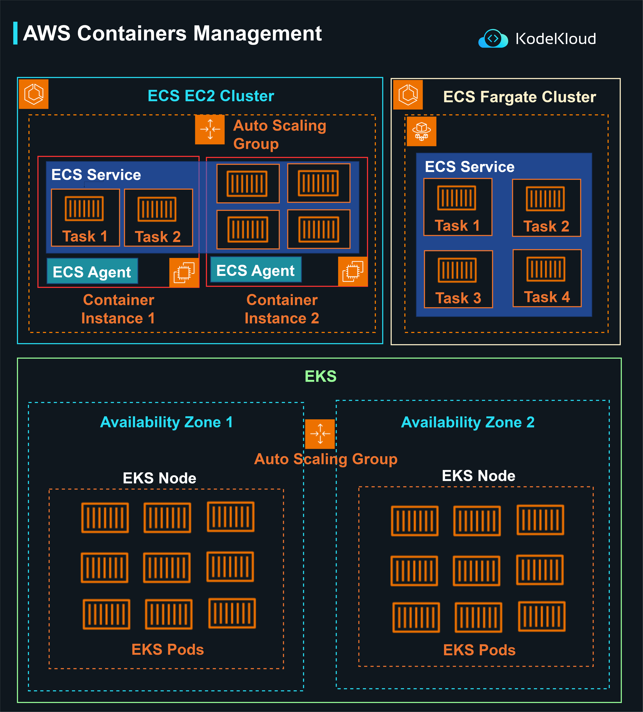

# AWS Containers Management (EKS, ECS, Fargate)

Amazon Web Services (AWS) provides multiple container management solutions. This breakdown explains the major services and how they work:

**1. ECS EC2 Cluster:**

-   **ECS (Elastic Container Service) on EC2**: It runs containers on EC2 (Elastic Compute Cloud) instances.
    -   **Auto Scaling Group**: Ensures that the cluster maintains the desired number of instances. If an instance fails, the Auto Scaling group replaces it.
    -   **ECS Agent**: Software running on each EC2 instance in the cluster, helping in connecting the instance to the ECS cluster.
    -   **ECS Service**: It defines the desired count and type of task that should run in the cluster.
        -   **Tasks**: Each task is a running container. In this diagram, there are Task 1 and Task 2.
    -   **Container Instances**: The underlying EC2 instances where tasks are scheduled. Here we have two instances: Container Instance 1 and Container Instance 2.

**2. ECS Fargate Cluster:**

-   **ECS on Fargate**: A serverless compute engine for running containers without the need to manage the underlying EC2 instances.
    -   **ECS Service**: Defines the desired tasks to run.
        -   **Tasks**: Containers to be run. In this setup, there are four tasks from Task 1 to Task 4.

**3. EKS (Elastic Kubernetes Service):**

-   **EKS**: A managed Kubernetes service that makes it easy to deploy, manage, and scale containerized applications using Kubernetes.
    -   **Availability Zones**: These are distinct locations within an AWS Region that are engineered to be isolated from failures. In the depicted structure, there are two availability zones: Availability Zone 1 and Availability Zone 2.
    -   **Auto Scaling Group**: Ensures that the EKS cluster maintains the desired number of nodes.
    -   **EKS Nodes**: These are the worker machines in Kubernetes. Here, we have nodes in each availability zone.
    -   **EKS Pods**: Group of one or more containers deployed to a single node. The diagram showcases multiple pods running in each EKS Node.

    

  

