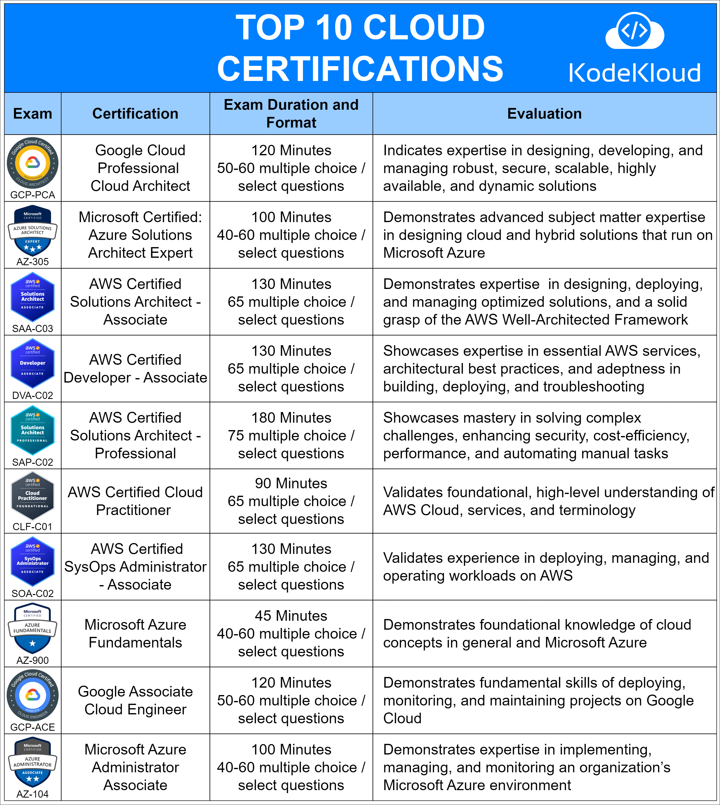

# Top 10 Cloud Certifications

If you're considering a career in cloud computing or looking to advance your current role, certifications are a great way to validate your skills. Here are the top 10 cloud certifications from renowned platforms:

----------

**1. Google Cloud Professional Cloud Architect (GCP-PCA)**

-   **Duration**: 120 Minutes
-   **Format**: 50-60 multiple choice / select questions
-   **Evaluation**: Indicates expertise in designing, developing, and managing robust, secure, scalable, highly available, and dynamic solutions.

----------

**2. Microsoft Certified: Azure Solutions Architect Expert (AZ-305)**

-   **Duration**: 100 Minutes
-   **Format**: 40-60 multiple choice / select questions
-   **Evaluation**: Demonstrates advanced subject matter expertise in designing cloud and hybrid solutions that run on Microsoft Azure.

----------

**3. AWS Certified Solutions Architect - Associate (SAA-C03)**

-   **Duration**: 130 Minutes
-   **Format**: 65 multiple choice / select questions
-   **Evaluation**: Demonstrates expertise in designing, deploying, and managing optimized solutions, and a solid grasp of the AWS Well-Architected Framework.

----------

**4. AWS Certified Developer - Associate (DVA-C02)**

-   **Duration**: 130 Minutes
-   **Format**: 65 multiple choice / select questions
-   **Evaluation**: Showcases expertise in essential AWS services, architectural best practices, and adeptness in building, deploying, and troubleshooting.

----------

**5. AWS Certified Solutions Architect - Professional (SAP-C02)**

-   **Duration**: 180 Minutes
-   **Format**: 75 multiple choice / select questions
-   **Evaluation**: Showcases mastery in solving complex challenges, enhancing security, cost-efficiency, performance, and automating manual tasks.

----------

**6. AWS Certified Cloud Practitioner (CLF-C01)**

-   **Duration**: 90 Minutes
-   **Format**: 65 multiple choice / select questions
-   **Evaluation**: Validates foundational, high-level understanding of AWS Cloud, services, and terminology.

----------

**7. AWS Certified SysOps Administrator - Associate (SOA-C02)**

-   **Duration**: 130 Minutes
-   **Format**: 65 multiple choice / select questions
-   **Evaluation**: Validates experience in deploying, managing, and operating workloads on AWS.

----------

**8. Microsoft Azure Fundamentals (AZ-900)**

-   **Duration**: 45 Minutes
-   **Format**: 40-60 multiple choice / select questions
-   **Evaluation**: Demonstrates foundational knowledge of cloud concepts in general and Microsoft Azure.

----------

**9. Google Associate Cloud Engineer (GCP-ACE)**

-   **Duration**: 120 Minutes
-   **Format**: 50-60 multiple choice / select questions
-   **Evaluation**: Demonstrates fundamental skills of deploying, monitoring, and maintaining projects on Google Cloud.

----------

**10. Microsoft Azure Administrator Associate (AZ-104)**

-   **Duration**: 100 Minutes
-   **Format**: 40-60 multiple choice / select questions
-   **Evaluation**: Demonstrates expertise in implementing, managing, and monitoring an organization’s Microsoft Azure environment.

----------

Pursuing any of these certifications can enhance your cloud skills and make you stand out in the competitive job market. Whether you are starting your cloud journey or are already in the field, these certifications will help solidify your standing and expertise.

  

