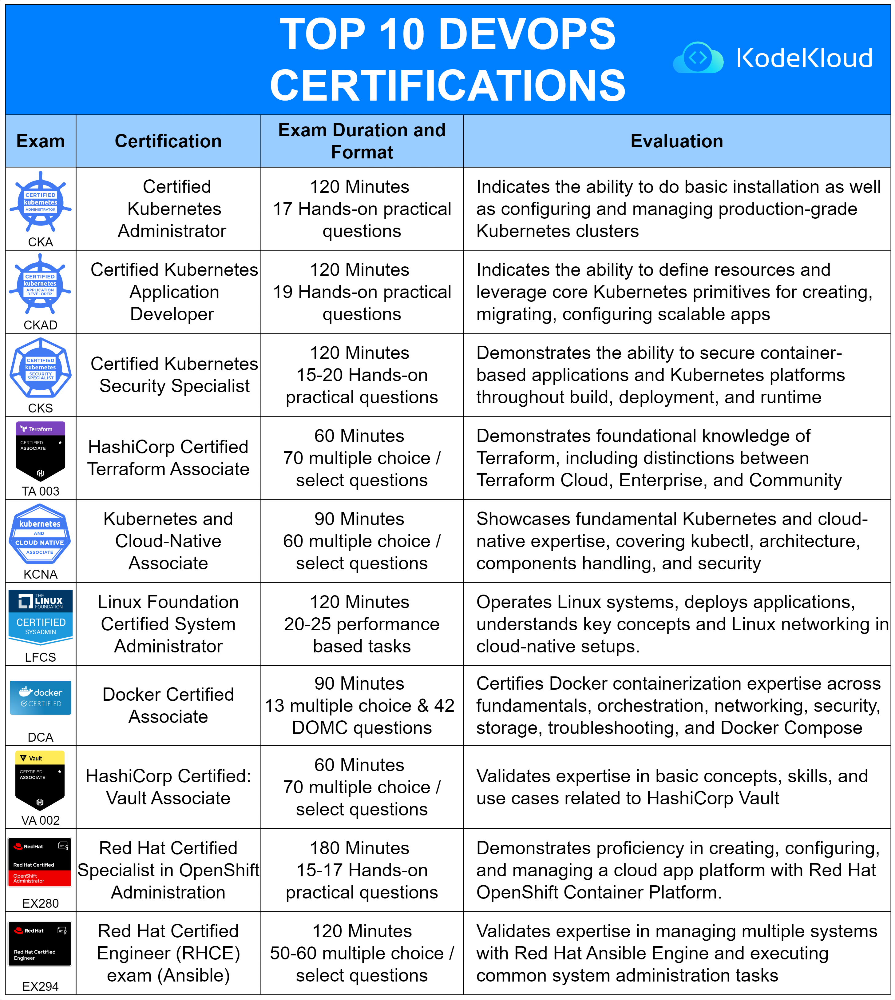

# Top 10 DevOps certifications

In the evolving world of DevOps, certification plays a pivotal role in validating an individual's technical expertise and understanding. Here's a detailed overview of the top 10 DevOps certifications to consider:

**1. Certified Kubernetes Administrator (CKA)**

-   **Exam Duration and Format**: 120 minutes with 17 hands-on practical questions.
-   **Evaluation**: Validates the capability to perform basic installations, configure, and manage production-grade Kubernetes clusters.

----------

**2. Certified Kubernetes Application Developer (CKAD)**

-   **Exam Duration and Format**: 120 minutes with 19 hands-on practical questions.
-   **Evaluation**: Emphasizes the ability to define resources, leverage core Kubernetes primitives for app creation, migration, and configuration of scalable apps.

----------

**3. Certified Kubernetes Security Specialist (CKS)**

-   **Exam Duration and Format**: 120 minutes with 15-20 hands-on practical questions.
-   **Evaluation**: Showcases proficiency in securing container-based applications and Kubernetes platforms through build, deployment, and runtime stages.

----------

**4. HashiCorp Certified Terraform Associate (TA 003)**

-   **Exam Duration and Format**: 60 minutes with 70 multiple choice/select questions.
-   **Evaluation**: Demonstrates foundational understanding of Terraform, distinguishing between Terraform Cloud, Enterprise, and Community editions.

----------

**5. Kubernetes and Cloud-Native Associate (KCNA)**

-   **Exam Duration and Format**: 90 minutes with 60 multiple choice/select questions.
-   **Evaluation**: Highlights basic expertise in Kubernetes and cloud-native aspects, encompassing kubectl, architecture, component management, and security.

----------

**6. Linux Foundation Certified System Administrator (LFCS)**

-   **Exam Duration and Format**: 120 minutes with 25 performance-based tasks.
-   **Evaluation**: Assesses the ability to operate Linux systems, deploy apps, grasp Linux key concepts, and integrate Linux networking in cloud-native environments.

----------

**7. Docker Certified Associate (DCA)**

-   **Exam Duration and Format**: 90 minutes with 13 multiple choice and 42 DOMC questions.
-   **Evaluation**: Certifies expertise in Docker containerization, spanning fundamentals, orchestration, networking, security, storage, troubleshooting, and Docker Compose.

----------

**8. HashiCorp Certified: Vault Associate (VA 002)**

-   **Exam Duration and Format**: 60 minutes with 70 multiple choice/select questions.
-   **Evaluation**: Validates proficiency in fundamental concepts, skills, and use cases related to HashiCorp Vault.

----------

**9. Red Hat Certified Specialist in OpenShift Administration (EX280)**

-   **Exam Duration and Format**: 180 minutes with 15-17 hands-on practical questions.
-   **Evaluation**: Demonstrates mastery in creating, configuring, and managing cloud platforms using Red Hat OpenShift Container Platform.

----------

**10. Red Hat Certified Engineer (RHCE) (Exam Ansible) (EX294)**

-   **Exam Duration and Format**: 120 minutes with 50-60 multiple choice/select questions.
-   **Evaluation**: Certifies expertise in managing and troubleshooting Red Hat Ansible Engine while executing common system administration tasks.

----------

These certifications validate an individual's proficiency in various DevOps tools and practices, making them essential for professionals in the field.

  

