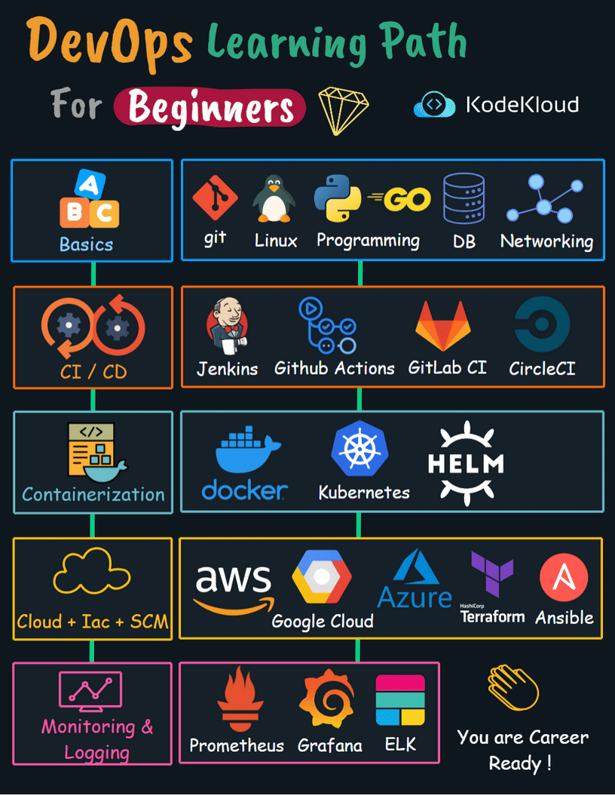

# DevOps Learning Path For Beginners

Diving into the dynamic world of DevOps can be both exhilarating and challenging. To ensure you have a seamless transition into this field, we've curated a comprehensive learning path. This guide breaks down pivotal tools and practices, ensuring you build a robust foundation, gain practical insights, and are poised for success in your DevOps endeavors.

Diving into the dynamic world of DevOps can be both exhilarating and challenging. To ensure you have a seamless transition into this field, we've curated a comprehensive learning path. This guide breaks down pivotal tools and practices, ensuring you build a robust foundation, gain practical insights, and are poised for success in your DevOps endeavors.

1.  **Basics**:
    
    -   **Git**: The backbone of version control, Git helps you manage and track changes in your codebase.
    -   **Linux**: Familiarize yourself with Linux OS, the most widely used environment in server-side operations.
    -   **Programming**: Get comfortable with a language like Go, which has become a staple in DevOps tool development.
    -   **DB**: Understand database management to ensure seamless data storage and retrieval.
    -   **Networking**: Grasp the basics of network operations to ensure efficient communication between systems.
2.  **Continuous Integration/Continuous Deployment (CI/CD)**:
    
    -   **Jenkins**: A leading automation server that facilitates continuous integration.
    -   **Github Actions**: Automate workflows directly from your GitHub repositories.
    -   **GitLab CI**: GitLab's built-in CI/CD component for automating software delivery.
    -   **CircleCI**: Another robust CI/CD platform that integrates with popular VCS like Git.
3.  **Containerization**:
    
    -   **Docker**: Learn how to create, deploy, and run applications using Docker containers.
    -   **Kubernetes**: Master the orchestration of containerized applications at scale with K8s.
    -   **Helm**: A package manager for Kubernetes that simplifies app deployment.
4.  **Cloud, Infrastructure as Code (IaC), & Source Code Management (SCM)**:
    
    -   **AWS (Amazon Web Services)**: Delve into this leading cloud service provider's extensive offerings.
    -   **Google Cloud**: Familiarize yourself with Google's cloud platform and its suite of tools.
    -   **Azure**: Microsoft's cloud solution, offering a plethora of services and tools.
    -   **Terraform**: HashiCorp's IaC tool for provisioning and managing cloud infrastructure.
    -   **Ansible**: An automation tool for IT tasks such as configuration management, application deployment, and more.
5.  **Monitoring & Logging**:
    
    -   **Prometheus**: An open-source system for monitoring and alerting.
    -   **Grafana**: A platform for monitoring and observability, often paired with Prometheus.
    -   **ELK Stack**: Elasticsearch, Logstash, and Kibana - a set of tools for searching, analyzing, and visualizing data in real-time.

  

