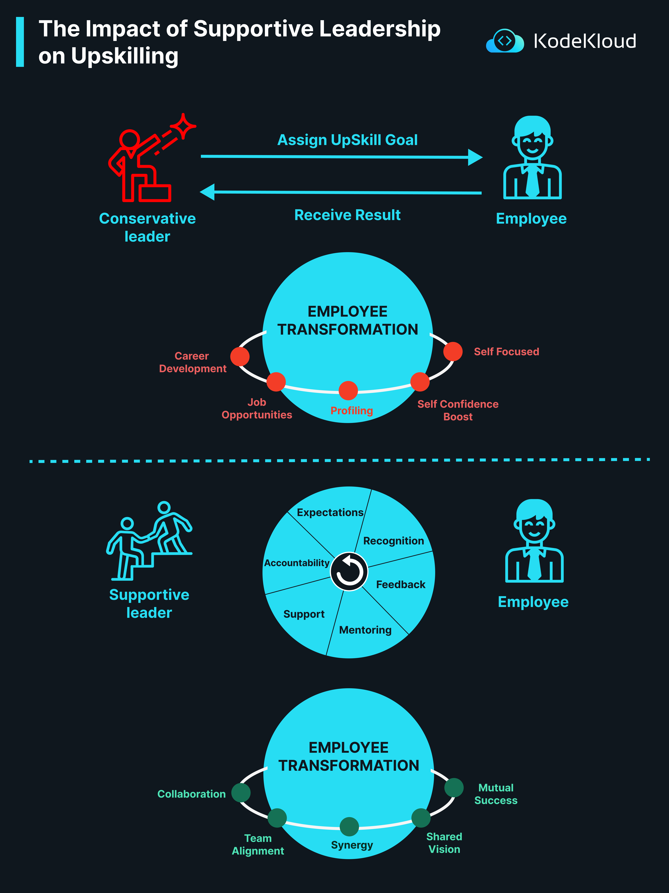

# How Supportive Leadership Impacts Upskill Eco System

The influence of leadership style on an employee's growth and transformation is undeniable. When we look at upskilling, which refers to the process of teaching employees new skills or improving their current ones, two leadership styles stand out: the Conservative Leader and the Supportive Leader. Both have a role to play, but their approach and impact on the employee's transformation journey can be notably different.

1.  **Conservative Leadership Approach**:
    
    -   **Process**: A conservative leader assigns an upskilling goal to the employee and waits to receive the result. There is a clear expectation set, but the approach might lack personal interaction or continuous feedback.
    -   **Employee Transformation under Conservative Leadership**:
        -   **Career Development**: Upskilling can lead to improved career prospects.
        -   **Job Opportunities**: With new skills, the employee can take on diverse roles or projects.
        -   **Profiling**: Upskilling can refine an employee's professional profile.
        -   **Self Focused**: The growth trajectory is primarily self-driven.
        -   **Self Confidence Boost**: Achieving upskilling goals boosts the employee's confidence.
2.  **Supportive Leadership Approach**:
    
    -   **Process**: Supportive leaders work alongside their employees. They offer mentoring, set clear expectations, provide consistent feedback, recognize achievements, and ensure accountability. They promote an environment of collaboration and mutual growth.
    -   **Employee Transformation under Supportive Leadership**:
        -   **Collaboration**: Employees learn the importance of teamwork and collective growth.
        -   **Team Alignment**: Everyone is on the same page, moving towards a shared goal.
        -   **Synergy**: Individual strengths are leveraged to create a harmonious and effective team.
        -   **Shared Vision**: The team and the leader work together towards a common objective, ensuring mutual success.

        

  

