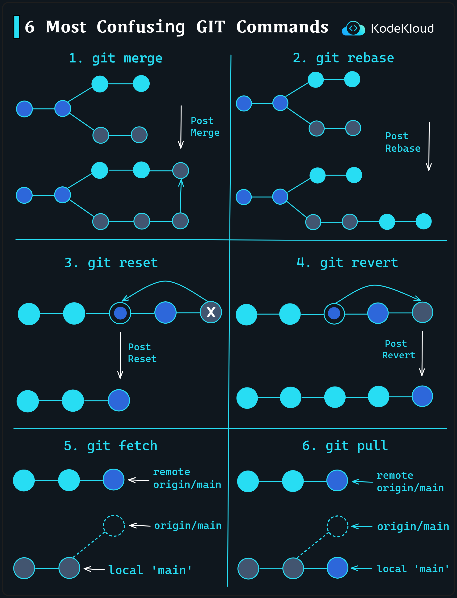

# 6 Most Confusing Git Commands

Understanding Git and its myriad commands can be a challenging task for many developers, especially when first introduced to it. Here, we're breaking down six of the most confusing Git commands, providing clarity on how they function:

1.  **`git merge`**:
    
    -   This command is used to combine multiple sequences of commits into one unified history.
    -   The visual representation shows two diverging commit sequences. After the `git merge`, they're combined, resulting in a "Post Merge" sequence.
2.  **`git rebase`**:
    
    -   Rebase is a way to integrate changes from one branch into another.
    -   It involves moving the entire sequence of commit history onto a new base commit.
    -   The representation showcases a sequence of commits being rebased, leading to a "Post Rebase" sequence.
3.  **`git reset`**:
    
    -   This command is used to undo changes in your working directory.
    -   The visualization displays a sequence of commits. After executing `git reset`, a portion of the commit sequence is removed, resulting in a "Post Reset" sequence.
4.  **`git revert`**:
    
    -   The `git revert` command undoes a committed snapshot but, instead of deleting the commit, it creates a new commit that undoes all the changes.
    -   The illustration presents a sequence of commits. After a `git revert`, a new commit is added to reverse the changes of a previous commit, leading to a "Post Revert" sequence.
5.  **`git fetch`**:
    
    -   This command is used to retrieve updates from a remote repository.
    -   The diagram depicts the flow from the "remote origin/main" to the local "main". It fetches the changes but doesn't merge them.
6.  **`git pull`**:
    
    -   A `git pull` is essentially a `git fetch` followed by a `git merge`.
    -   It retrieves updates from a remote repository and then merges them into the current branch in the local repository.
    -   The representation indicates the flow from the "remote origin/main" to the local "main", highlighting both fetching and merging processes.

    

  

