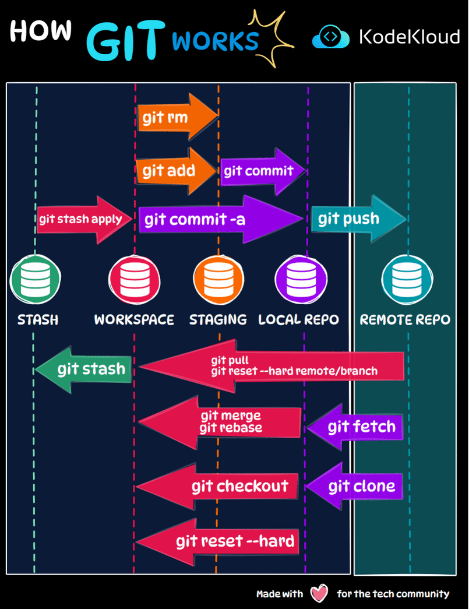

# How Git Works?

Git is an essential tool for software development, providing a robust version control system. Understanding how various Git commands interact with different areas of a project can streamline your development process. Let's break down the flow.

**1. Stash Area:**

-   **`git stash`**: Temporarily saves changes that you don't want to commit immediately. It pushes changes from your workspace to a "stash" and lets you apply them later.
    
-   **`git stash apply`**: Brings back the stashed changes to the workspace.
    

**2. Workspace:** This is where you'll be making changes to your files.

-   **`git rm`**: Removes files from the workspace and the staging area.
-   **`git add`**: Adds changes from the workspace to the staging area, preparing them for a commit.
-   **`git commit -a`**: A shortcut that automatically stages all modified and deleted files, then commits them.

**3. Staging Area:** Before finalizing changes with a commit, you stage them.

-   **`git commit`**: Takes the staged changes and commits them to the local repository.

**4. Local Repository:** This is where committed changes reside on your local machine.

-   **`git push`**: Sends commits from the local repository to a remote repository.
-   **`git pull`**: Fetches changes from a remote repository and merges them into the current branch of the local repository.
-   **`git reset --hard`**: Resets your local repository to match the state of the remote repository, discarding all local changes.
-   **`git reset --hard remote/branch`**: Resets your local branch to the state of a remote branch.
-   **`git merge` & `git rebase`**: Integrates changes from one branch into another in the local repo. While `merge` combines commit histories, `rebase` moves the entire commit sequence to a new base commit.
-   **`git checkout`**: Switches between branches or restores working tree files.

**5. Remote Repository:** This represents the server where your code resides, accessible to all team members.

-   **`git fetch`**: Retrieves changes from the remote repository without merging them.
-   **`git clone`**: Copies a Git repository, typically from a remote source to your local machine.

Remember, understanding the flow and functions of each command can enhance collaboration, maintain code history, and ensure smooth deployments.

  

