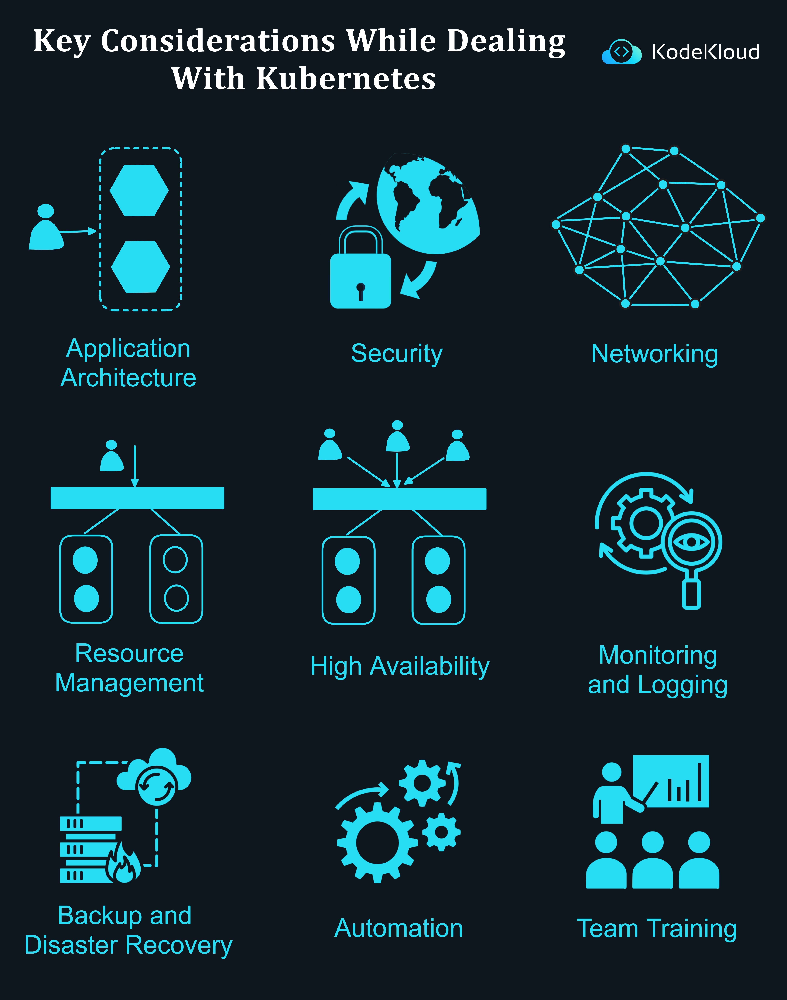

# Key Considerations While Dealing With Kubernetes

Kubernetes has revolutionized container orchestration and brought about a paradigm shift in cloud-native deployments. However, its effective implementation requires several essential considerations to ensure optimum performance, security, and manageability. Here's a detailed breakdown of the key factors to consider:

1.  **Application Architecture**: An efficient Kubernetes deployment begins with a well-designed application architecture. It's essential to ensure that the applications are modular and adhere to microservices principles, allowing them to scale and operate seamlessly within the Kubernetes environment.
    
2.  **Security**: Protecting your Kubernetes clusters is paramount. Considerations around security include setting up appropriate access controls, ensuring data encryption, and implementing network policies. Regular vulnerability assessments can also safeguard against potential threats.
    
3.  **Networking**: Networking plays a crucial role in connecting pods, services, and external applications. Ensuring proper network configurations, implementing ingress and egress rules, and maintaining a balance between performance and security are vital.
    
4.  **Resource Management**: Allocating appropriate resources (CPU, memory, and storage) to different pods and nodes ensures that applications run efficiently. It's also important to monitor resource consumption and adjust allocations as required.
    
5.  **High Availability**: For business-critical applications, it's essential to design your Kubernetes clusters with high availability in mind. This involves setting up multi-node clusters, having redundancy in place, and ensuring that workloads can be quickly redistributed in the event of node failures.
    
6.  **Monitoring and Logging**: Keeping an eye on cluster health, performance metrics, and logs aids in proactive troubleshooting. Tools like Prometheus for monitoring and Fluentd or ELK stack for logging can be invaluable.
    
7.  **Backup and Disaster Recovery**: Regular backups of your Kubernetes configuration, data, and state are crucial. Additionally, having a disaster recovery plan in place ensures that you can quickly restore operations in case of catastrophic failures.
    
8.  **Automation**: Automating repetitive tasks such as deployments, scaling, and updates can boost efficiency. Utilizing tools like Helm for package management and setting up CI/CD pipelines can simplify these tasks.
    
9.  **Team Training**: As Kubernetes is a complex system with a steep learning curve, investing in team training can pay dividends. Ensuring that your team is well-versed with Kubernetes concepts, tools, and best practices will lead to smoother deployments and operations.

  

