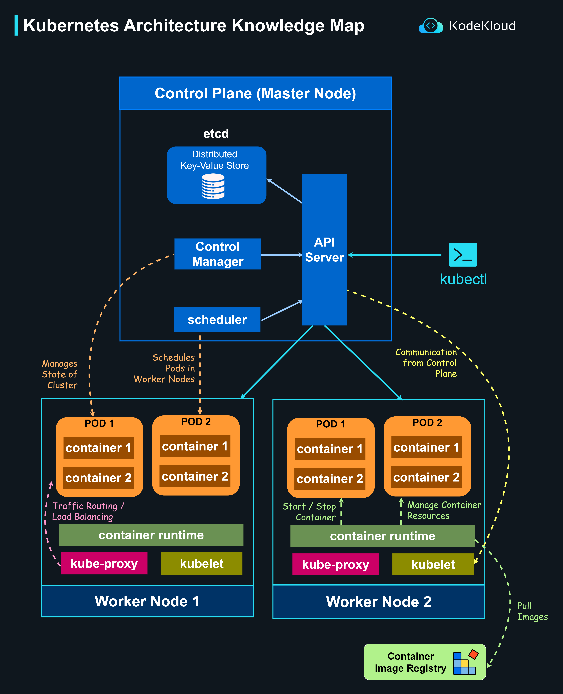

# Kubernetes Architecture Knowledge Map

Understanding the Kubernetes architecture is essential for deploying and managing containerized applications. Here's a breakdown of the core components and their interactions based on the knowledge map:

**1. Control Plane (Master Node)** The control plane's components make global decisions about the cluster (e.g., scheduling), as well as detecting and responding to cluster events.

-   **etcd**: A consistent and highly-available distributed key-value store used by Kubernetes to save all cluster data, ensuring distributed system's state consistency.
    
-   **API Server**: Acts as the entry point for commands sent to the cluster. It processes and validates REST requests and updates the corresponding objects in etcd.
    
-   **Control Manager**: Regulates controllers that manage the state of the system. For example, it oversees the replication controller to maintain the correct number of pod replicas.
    
-   **Scheduler**: Observes unscheduled pods and binds them to worker nodes based on resource availability and other constraints. It effectively decides on which node an application instance needs to run.
    
-   **kubectl**: The command-line interface tool for interacting with the cluster. It communicates with the API Server to create, view, and manage cluster resources.
    

----------

**2. Worker Nodes** Worker nodes are responsible for running containerized applications. Each node is managed by the control plane.

-   **Pods**: Smallest deployable units in Kubernetes that can contain one or more containers. Each pod has its IP address, storage resources, and specifications on how to run containers.
    
    -   **Container**: An instance of an image that holds the software needed to run an application. Containers within the same pod share the same network IP, port space, and storage.
-   **Container Runtime**: Software responsible for running containers. It pulls container images from a registry, unpacks them, and runs them.
    
-   **kubelet**: An agent running on each node in the cluster. It ensures that containers are running in a Pod. It communicates with the control plane to receive commands and work.
    
-   **kube-proxy**: Maintains network rules for Pod communication. It allows network communication to and from pods and performs connection forwarding.
    

----------

**3. Container Image Registry**

-   This is where container images are stored. The container runtime will pull the necessary images from this registry to launch containers on the worker nodes.

----------

In summary, Kubernetes operates with a master-worker node architecture. The control plane (master node) governs the cluster, making crucial decisions, while worker nodes execute the containerized applications. The seamless interaction between these components ensures efficient orchestration of container applications.

  

