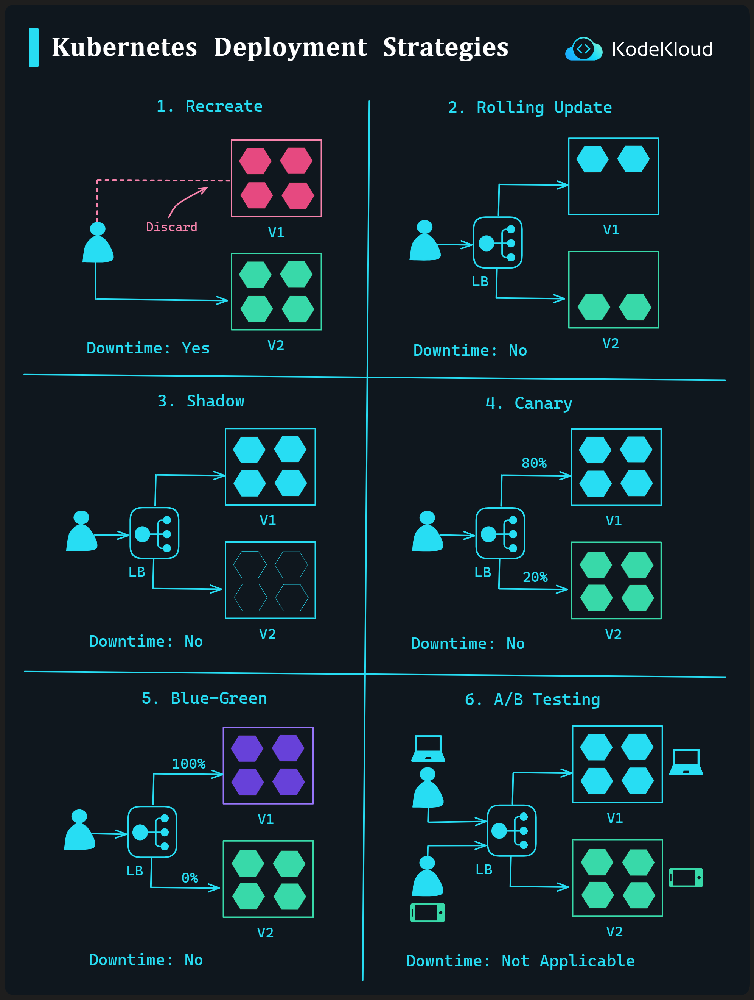

# Kubernetes Deployment Strategies

Deploying applications effectively and efficiently on Kubernetes requires leveraging suitable strategies based on your use-case. Here's an overview of six common Kubernetes deployment strategies:

**1. Recreate Strategy**

-   **Description**: This strategy discards the current version (V1) of the application and replaces it with a new version (V2).
-   **Visual**: Version V1 (depicted in pink) is discarded and replaced by Version V2 (depicted in green).
-   **Downtime**: Yes. There will be downtime during the transition.

----------

**2. Rolling Update Strategy**

-   **Description**: The existing pods (V1) are replaced incrementally with the new version (V2) pods. The load balancer (LB) seamlessly redirects the traffic.
-   **Visual**: Starting with Version V1 (blue), pods are progressively replaced by Version V2 (green) while maintaining availability through a Load Balancer (LB).
-   **Downtime**: No. Users experience zero downtime during the transition.

----------

**3. Shadow Strategy**

-   **Description**: The new version (V2) is deployed alongside the current version (V1). However, real traffic is still sent only to the current version while mirroring the same traffic to the new version for testing purposes.
-   **Visual**: Both Version V1 (blue) and Version V2 (black) run simultaneously, but the Load Balancer (LB) directs actual user traffic only to V1.
-   **Downtime**: No. The existing version continues serving users.

----------

**4. Canary Strategy**

-   **Description**: A small percentage of traffic is directed to the new version (V2) to gauge its performance and reliability. Depending on results, the rollout can be scaled or rolled back.
-   **Visual**: While most of the traffic still goes to Version V1 (blue), a fraction (e.g., 20%) is directed to Version V2 (green) via a Load Balancer (LB).
-   **Downtime**: No. Both versions run concurrently, ensuring availability.

----------

**5. Blue-Green Strategy**

-   **Description**: Two environments - Blue (V1) and Green (V2) - are maintained. Once the Green environment is ready and tested, traffic is switched entirely from Blue to Green.
-   **Visual**: Initially, 100% of traffic is on Version V1 (purple). Once V2 (green) is confirmed ready, the Load Balancer (LB) switches 100% of the traffic to it.
-   **Downtime**: No. The switch is instantaneous, ensuring continuous availability.

----------

**6. A/B Testing Strategy**

-   **Description**: Different versions of the application are exposed to different user segments. This is not just about performance but also about understanding user preferences and behaviors.
-   **Visual**: Different user segments (represented by different icons) are directed to either Version V1 (blue) or Version V2 (green) based on criteria.
-   **Downtime**: Not Applicable. As it's more about testing different features or interfaces rather than a typical upgrade.

  

