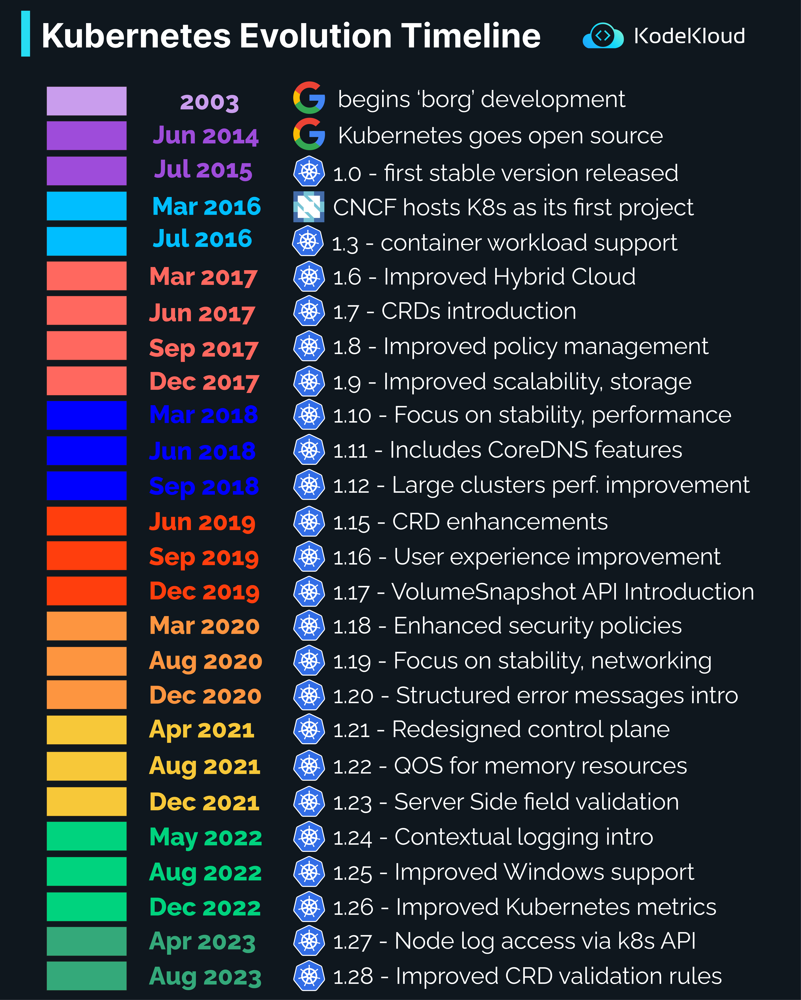

# Kubernetes Evolution

Kubernetes, widely known as K8s, has become the de-facto standard for container orchestration. Its evolution timeline showcases the advancements and improvements made over the years. Let's take a walk through this timeline:

**1. Early Beginnings and Foundation**

-   **2003**: Google initiates the development of 'borg', a predecessor to Kubernetes.
-   **Jun 2014**: Kubernetes is announced as an open-source project by Google.
-   **Jul 2015**: The first stable version, **Kubernetes 1.0**, is released.

----------

**2. Expansion and Adoption**

-   **Mar 2016**: The Cloud Native Computing Foundation (CNCF) adopts Kubernetes as its inaugural project.
-   **Jul 2016**: Version **1.3** is released, adding enhanced support for container workloads.
-   **Mar 2017**: Version **1.6** brings improvements for Hybrid Cloud environments.
-   **Jun 2017**: The introduction of Custom Resource Definitions (CRDs) occurs in version **1.7**.
-   **Sep 2017**: Kubernetes **1.8** focuses on improved policy management.
-   **Dec 2017**: Version **1.9** is noted for its enhancements in scalability and storage features.

----------

**3. Emphasis on Performance and Stability**

-   **Mar 2018**: Kubernetes **1.10** emphasizes stability and performance.
-   **Jun 2018**: The **1.11** release includes new features from CoreDNS.
-   **Sep 2018**: Large cluster performance improvements are highlighted in version **1.12**.

----------

**4. Enhancements and Usability Improvements**

-   **Jun 2019**: Version **1.15** focuses on enhancements to CRDs.
-   **Sep 2019**: Kubernetes **1.16** brings significant user experience improvements.
-   **Dec 2019**: The introduction of the VolumeSnapshot API is a highlight of version **1.17**.
-   **Mar 2020**: Enhanced security policies are the focus of version **1.18**.

----------

**5. Refinements and Advanced Features**

-   **Aug 2020**: Kubernetes **1.19** emphasizes stability and networking.
-   **Dec 2020**: Structured error messaging is introduced in version **1.20**.
-   **Apr 2021**: The **1.21** release unveils a redesigned control plane.
-   **Aug 2021**: Quality of Service (QOS) for memory resources becomes a feature in version **1.22**.
-   **Dec 2021**: Version **1.23** showcases server-side field validation.

----------

**6. Latest Innovations**

-   **May 2022**: Contextual logging is introduced in Kubernetes **1.24**.
-   **Aug 2022**: Improved support for Windows is the highlight of version **1.25**.
-   **Dec 2022**: Kubernetes **1.26** focuses on enhanced metrics.
-   **Apr 2023**: Node log access through the Kubernetes API becomes available in version **1.27**.
-   **Aug 2023**: The **1.28** release brings improved validation rules for CRDs.

----------

In conclusion, the Kubernetes evolution timeline is a testament to its rapid growth and the community's dedication to making it the top orchestration platform for containers. As Kubernetes continues to evolve, it brings forward new features, improvements, and refinements, ensuring it remains at the forefront of container technology.

  

