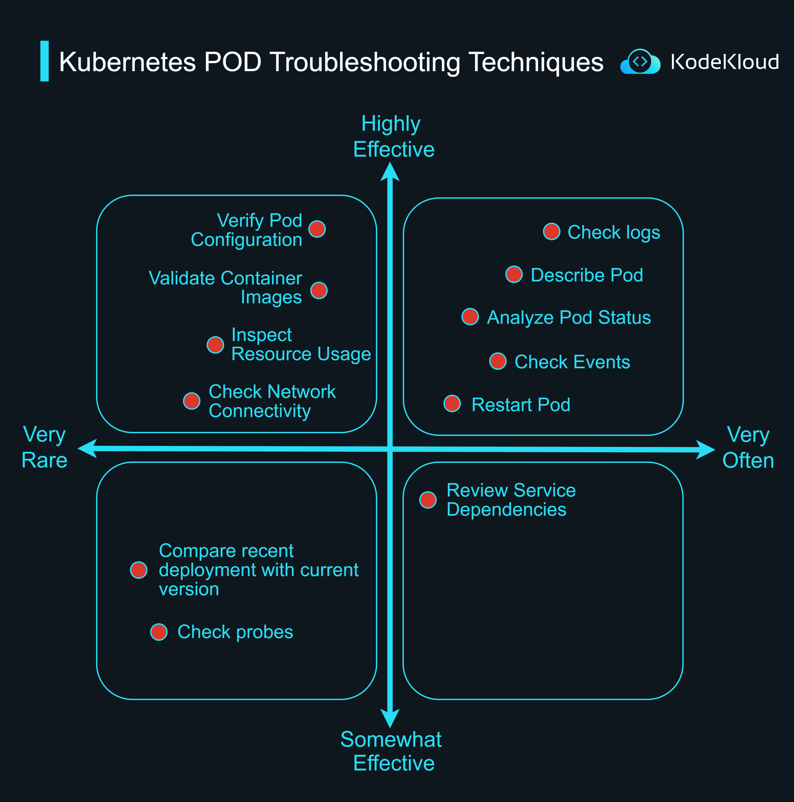

# Kubernetes POD Troubleshooting Techniques

When working with Kubernetes, it's crucial to understand the best techniques to troubleshoot issues effectively. The following is a categorization based on the frequency of usage and effectiveness:

## 1. Highly Effective & Very Often Used Techniques:

These are your go-to techniques that are both frequently used and very effective.

-   Check Logs: Always start with checking the logs. They provide a direct insight into what might be going wrong with your POD.
```bash
    kubectl logs <pod_name>
```
-   Describe Pod: This gives detailed information about the Pod, including its current status, recent events, and configuration.
```bash
    kubectl describe pod <pod_name>
```
-   Analyze Pod Status: Understanding the status can help pinpoint if the Pod is running, pending, failed, or in another state.
```bash
    kubectl get pod <pod_name>
```    
-   Check Events: Events give a chronological account of what has been happening with the Pod and can shed light on issues.
```bash
    kubectl get events
```
-   Restart Pod: Sometimes, the easiest way to fix a minor glitch is by simply restarting the Pod.
```bash
    kubectl rollout restart deployment/<deployment_name>
```
## Highly Effective but Rarely Used Techniques:

These techniques are extremely useful but might not be the first line of troubleshooting due to their specific applicability.

-   Verify Pod Configuration: Ensure the Pod's configuration is correct. Any misconfiguration can lead to issues.
```bash
    kubectl get pod <pod_name> -o yaml
```
-   Validate Container Images: Ensure that the container images are available, not corrupted, and compatible.
```bash
    kubectl get pod <pod_name> -o=jsonpath='{.spec.containers[*].image}'.
```
-   Inspect Resource Usage: Overutilization or lack of resources can lead to Pod failures. Check CPU, memory, and other resource usage.
```bash
    kubectl top pod <pod_name>
```
-   Check Network Connectivity: Ensure that the Pod can communicate with other Pods, services, and external networks.

Get a shell in the running container
```bash
_kubectl exec -it <pod_name> – sh_
```
Use ‘ping’ or ‘curl’ to test network connectivity
```bash
ping <target_host>
curl <target_url>
```

## 3. Somewhat Effective Techniques:

While not the first choices, these techniques can still provide valuable insights in some troubleshooting scenarios.

-   Review Service Dependencies: Ensure that all services that the Pod depends on are running and reachable.

> Analyze dependencies in the YAML or documentation to ensure required services are available and running
  
-   Compare Recent Deployment with Current Version: Sometimes, issues arise after updates. Comparing the current version with the last known good deployment can highlight changes that caused problems.
```bash
    kubectl rollout history deployment/<deployment_name> --revision=<old_revision_number>’
```
```bash
    kubectl rollout history deployment/<deployment_name> --revision=<new_revision_number>
```
-   Check Probes: Probes, like liveness and readiness, provide insights into the Pod's health and readiness to serve traffic. Ensure they are configured correctly.
```bash
    kubectl describe pod <pod_name>
 ```
> Look for the "LivenessProbe", "ReadinessProbe", and "StartupProbe" sections to see if the probes are passing or failing.

<p></p>
<p>
  
</p>


