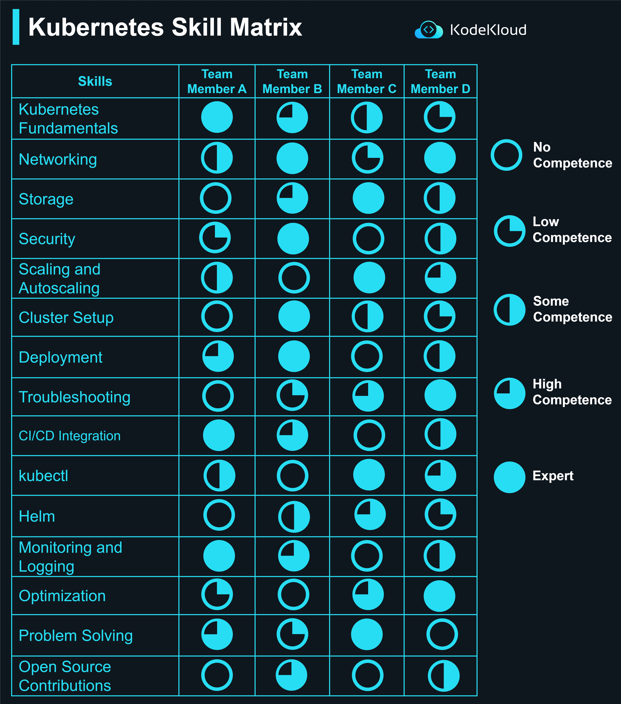

# Kubernetes Skill Matrix

Welcome to a fun, interactive way to evaluate and enhance your skillset! Let's transform your learning journey into an engaging game.

## How Does It Work?

1.  **Score Your Skills**: For each skill you possess, rate yourself on a scale from 1 to 5.
    
    -   1 - _Beginner_: Little to no knowledge.
    -   2 - _Basic_: Basic understanding but might need more training.
    -   3 - _Competent_: Good understanding and can manage tasks.
    -   4 - _Advanced_: Can perform tasks independently and efficiently.
    -   5 - _Master_: Deep expertise and can lead or mentor others.
2.  **Calculate Your Total Score**: Sum up your scores for each skill.
    
3.  **Determine Your Level**:
    
    -   _Novice_ (< 20 points): You're just starting out. There's much to learn and explore.
    -   _Intermediate_ (20-29 points): You have a foundational grasp and are on the right track. Keep going!
    -   _Proficient_ (30-39 points): You have a strong understanding and can handle tasks with ease. You're nearing mastery.
    -   _Expert_ (40+ points): You're at the pinnacle of knowledge. Consider mentoring and leading in this area.
4.  **Feedback & Insights**:
    
    -   **Novice**: Dive into tutorials and foundational courses. Join forums to ask questions.
    -   **Intermediate**: Engage in hands-on projects and workshops. Collaborate with peers.
    -   **Proficient**: Attend advanced courses and webinars. Seek real-world challenges.
    -   **Expert**: Consider conducting workshops, authoring content, or mentoring newcomers.

**What Comes After?**

_Plan Your Growth_: Based on your level, set goals for the areas you want to improve in. Enroll in courses, seek mentors, or work on specific projects that will help you level up.

_Collaborate_: Engage with your team. Share your scores (if you're comfortable) and brainstorm ways to collectively enhance your team's capabilities.

_Re-assess & Evolve_: Regularly come back to this assessment. As you grow, your score will too!

**Disclaimer**: The competencies highlighted are purely illustrative. Real assessments may vary based on the skillset in question and the industry's requirements. Always seek feedback from peers and mentors for a comprehensive evaluation.

  

