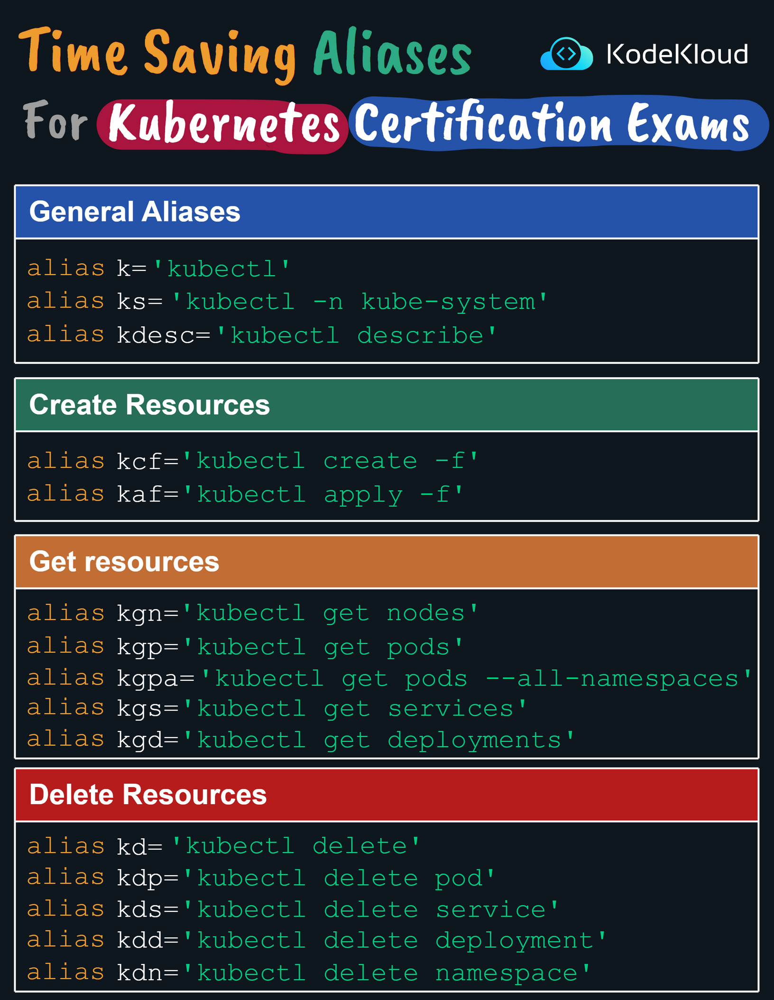

# Time-Saving Aliases for Kubernetes Certification Exams

Working with Kubernetes requires executing numerous commands through the command line, and these commands can sometimes be lengthy. To expedite this process, particularly during Kubernetes certification exams, you can use aliases. Here's a collection of helpful aliases to boost your efficiency:

----------

**General Aliases**:

1.  **k**: Shortcut for `kubectl`
    
    -   **Command**: `alias k='kubectl'`
2.  **ks**: Shortcut for accessing the `kube-system` namespace.
    
    -   **Command**: `alias ks='kubectl -n kube-system'`
3.  **kdesc**: Shortcut for the `describe` command.
    
    -   **Command**: `alias kdesc='kubectl describe'`

----------

**Create Resources**:

1.  **kcf**: Shortcut to create resources using a file.
    
    -   **Command**: `alias kcf='kubectl create -f'`
2.  **kaf**: Shortcut to apply configurations using a file.
    
    -   **Command**: `alias kaf='kubectl apply -f'`

----------

**Get Resources**:

1.  **kgn**: Shortcut to get nodes.
    
    -   **Command**: `alias kgn='kubectl get nodes'`
2.  **kgp**: Shortcut to get pods.
    
    -   **Command**: `alias kgp='kubectl get pods'`
3.  **kgra**: Shortcut to get pods across all namespaces.
    
    -   **Command**: `alias kgra='kubectl get pods --all-namespaces'`
4.  **kgs**: Shortcut to get services.
    
    -   **Command**: `alias kgs='kubectl get services'`
5.  **kgd**: Shortcut to get deployments.
    
    -   **Command**: `alias kgd='kubectl get deployments'`

----------

**Delete Resources**:

1.  **kd**: Shortcut to delete resources.
    
    -   **Command**: `alias kd='kubectl delete'`
2.  **kdp**: Shortcut to delete a pod.
    
    -   **Command**: `alias kdp='kubectl delete pod'`
3.  **kds**: Shortcut to delete a service.
    
    -   **Command**: `alias kds='kubectl delete service'`
4.  **kdd**: Shortcut to delete a deployment.
    
    -   **Command**: `alias kdd='kubectl delete deployment'`
5.  **kdn**: Shortcut to delete a namespace.
    
    -   **Command**: `alias kdn='kubectl delete namespace'`

----------

Implementing these aliases can significantly speed up your command execution, especially during timed scenarios like certification exams. It's a practical way to ensure you're working as efficiently as possible with Kubernetes.

  

