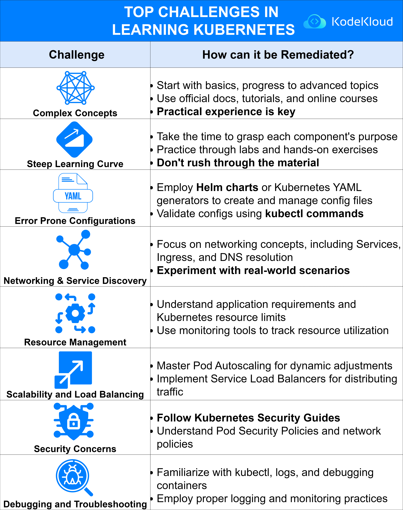

# Top Challenges in learning Kubernetes

Learning Kubernetes, while rewarding, can present several challenges. Here's a breakdown of these challenges and actionable advice on how to address each:

----------

**1. Complex Concepts**

-   **The Challenge**: Kubernetes is a vast system with many interconnected components and features.
-   **How to Remediate**:
    -   **Start with Basics**: Begin with foundational concepts and progressively move to more advanced topics.
    -   **Leverage Resources**: Rely on official documentation, tutorials, and online courses to deepen your understanding.
    -   **Hands-on Practice**: Engaging in practical experience, such as working on real projects, is essential.

----------

**2. Steep Learning Curve**

-   **The Challenge**: Grasping all the intricacies of Kubernetes can feel overwhelming.
-   **How to Remediate**:
    -   **Pace Yourself**: Understand each component's purpose before moving to the next.
    -   **Engage in Labs**: Reinforce your learning with hands-on exercises and labs.
    -   **Avoid Rushing**: Ensure comprehension before advancing to prevent knowledge gaps.

----------

**3. Error Prone Configurations**

-   **The Challenge**: Kubernetes configurations, especially in YAML, can be susceptible to errors.
-   **How to Remediate**:
    -   **Use Tools**: Employ Helm charts or Kubernetes YAML generators for creating and managing configuration files.
    -   **Validation**: Regularly validate configurations with `kubectl` commands to catch and rectify errors.

----------

**4. Networking & Service Discovery**

-   **The Challenge**: Ensuring seamless communication between pods and services can be tricky.
-   **How to Remediate**:
    -   **Deep Dive into Networking**: Understand core concepts like Services, Ingress, and DNS resolution.
    -   **Experiment**: Work on real-world scenarios to get a feel for networking challenges and solutions.

----------

**5. Resource Management**

-   **The Challenge**: Efficiently allocating and managing resources for applications is crucial.
-   **How to Remediate**:
    -   **Know Your Apps**: Understand the specific requirements of your applications and how they align with Kubernetes resource limits.
    -   **Monitor**: Utilize monitoring tools to keep an eye on resource utilization, ensuring optimal performance.

----------

**6. Scalability and Load Balancing**

-   **The Challenge**: Ensuring that applications can scale and handle incoming traffic effectively is vital.
-   **How to Remediate**:
    -   **Auto-scaling**: Master Pod Autoscaling to dynamically adjust resources based on demand.
    -   **Distribute Traffic**: Implement Service Load Balancers to evenly distribute incoming traffic.

----------

**7. Security Concerns**

-   **The Challenge**: Safeguarding Kubernetes clusters and applications from threats is paramount.
-   **How to Remediate**:
    -   **Stay Updated**: Regularly consult Kubernetes Security Guides for best practices.
    -   **Implement Policies**: Understand and enforce Pod Security Policies and network policies for added protection.

----------

**8. Debugging and Troubleshooting**

-   **The Challenge**: Identifying and rectifying issues within Kubernetes can be challenging.
-   **How to Remediate**:
    -   **Know Your Tools**: Get comfortable with tools like `kubectl`, focusing on logs and debugging containers.
    -   **Monitor and Log**: Adopt proper logging and monitoring practices to catch and address issues promptly.

    

  

