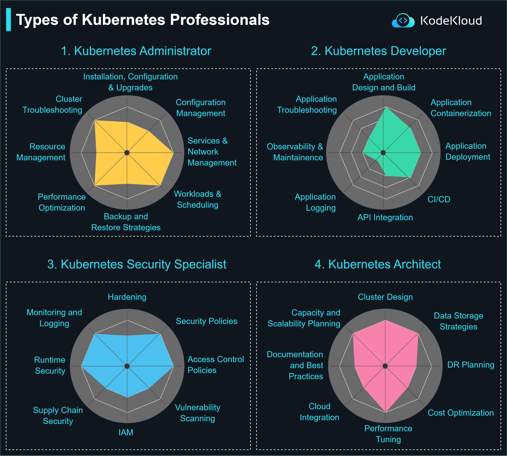

# Types of Kubernetes Professionals

Kubernetes, as one of the leading container orchestration platforms, necessitates a wide range of professionals to design, deploy, manage, and secure its environments. From administrators to developers, each role has its unique set of responsibilities, ensuring smooth and effective cluster operations. Here's a detailed look at the types of Kubernetes professionals and their core responsibilities.

## 1. Kubernetes Administrator

A Kubernetes Administrator has a broad range of responsibilities that primarily revolve around the maintenance and management of Kubernetes clusters. Their main responsibilities include:

-   **Installation, Configuration & Upgrades**: Ensuring the cluster is set up correctly and kept up-to-date with the latest versions and patches.
-   **Cluster Troubleshooting**: Addressing any issues within the cluster and ensuring its smooth operation.
-   **Configuration Management**: Managing the configuration files and settings for the various components within the cluster.
-   **Services & Network Management**: Overseeing the services running on the cluster and managing the networking aspects, ensuring seamless communication between pods.
-   **Resource Management**: Allocating and monitoring resources such as CPU, memory, and storage.
-   **Performance Optimization**: Tuning the performance of the cluster to ensure it operates efficiently.
-   **Workloads & Scheduling**: Managing the deployment of various workloads and ensuring they are scheduled correctly on the right nodes.
-   **Backup and Restore Strategies**: Implementing backup solutions and strategies for data recovery in case of any failures.

## 2. Kubernetes Developer

Kubernetes Developers focus on building applications that run on Kubernetes. Their main responsibilities include:

-   **Application Design and Build**: Designing and building applications tailored for Kubernetes environments.
-   **Application Troubleshooting**: Debugging and resolving issues related to applications running on Kubernetes.
-   **Application Containerization**: Packaging applications into containers for deployment on Kubernetes.
-   **Application Deployment**: Rolling out applications onto a Kubernetes cluster.
-   **Observability & Maintenance**: Monitoring the health and performance of applications and ensuring their smooth operation.
-   **Application Logging**: Implementing and managing logging solutions for applications.
-   **CI/CD**: Integrating continuous integration and continuous deployment pipelines for applications.
-   **API Integration**: Integrating various APIs into applications as required.

## 3. Kubernetes Security Specialist

A specialist in this area ensures the security of the Kubernetes cluster and its workloads. Their responsibilities include:

-   **Hardening**: Strengthening the security aspects of the Kubernetes cluster.
-   **Monitoring and Logging**: Implementing solutions to monitor and log security-related events.
-   **Runtime Security**: Ensuring the security of applications while they are running.
-   **Security Policies**: Implementing and enforcing security policies within the cluster.
-   **Access Control Policies**: Setting up and managing who has access to what within the cluster.
-   **Supply Chain Security**: Ensuring the security of the entire application lifecycle.
-   **Vulnerability Scanning**: Scanning for and addressing vulnerabilities within the cluster.
-   **IAM (Identity and Access Management)**: Managing identities and their permissions within the cluster.

## 4. Kubernetes Architect

A Kubernetes Architect designs the structure and layout of Kubernetes deployments. Their main responsibilities include:

-   **Cluster Design**: Designing the architecture of the Kubernetes cluster.
-   **Capacity and Scalability Planning**: Planning for future growth and ensuring the cluster can scale as required.
-   **Data Storage Strategies**: Deciding and implementing storage solutions for the cluster.
-   **Documentation and Best Practices**: Documenting the cluster's design and ensuring best practices are followed.
-   **DR (Disaster Recovery) Planning**: Planning for any potential disasters and ensuring there are recovery strategies in place.
-   **Cloud Integration**: Integrating Kubernetes with various cloud providers.
-   **Performance Tuning**: Ensuring the cluster performs at its best.
-   **Cost Optimization**: Ensuring the cluster runs cost-effectively.

  

