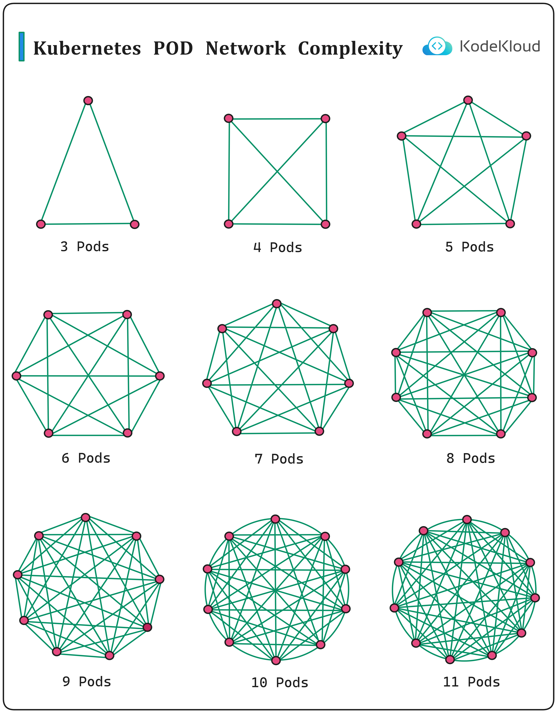

### Why Kubernetes POD Networking is Complex?

Visualizing Kubernetes Pod Network Complexity

When considering Kubernetes and its networking model, one might wonder about the implications of scaling, particularly as the number of pods increases. This illustration titled "Kubernetes POD Network Complexity" provides a graphical representation of this escalating complexity, capturing the intricate inter-pod communication as clusters grow.

Inter-Pod Connections:
The image highlights a progression:

3 Pods: At the smallest scale, with just three pods, the connections form a simple triangle. This means each pod can directly communicate with the other two.
4 Pods: With four pods, the scenario changes slightly. Beyond the perimeter connections, diagonal connections are added, reinforcing the idea that every pod can reach any other pod directly.
5 Pods and Beyond: As we add more pods, the complexity escalates rapidly. By the time we reach 11 pods, the visualization looks more like a dense web, with myriad connections crisscrossing each other.
This representation underscores a fundamental principle of Kubernetes networking: every pod should be able to communicate with every other pod, no matter where they are scheduled within the cluster. Such a setup ensures robustness and flexibility but comes with increased complexity as seen.

Implications of the Complexity:
This expanding web of connections is more than just lines on a graphic; it has real-world implications:

Performance Considerations: As the number of connections increases, ensuring low latency and high throughput can become challenging.
Security: With more connections, there's a heightened need for effective network policies to prevent unauthorized access and potential breaches.
Management Overhead: More connections can lead to increased difficulty in monitoring, troubleshooting, and managing the network.
Resource Utilization: Each connection might consume system resources, and with hundreds or thousands of pods, this can have implications on the underlying infrastructure.

  

